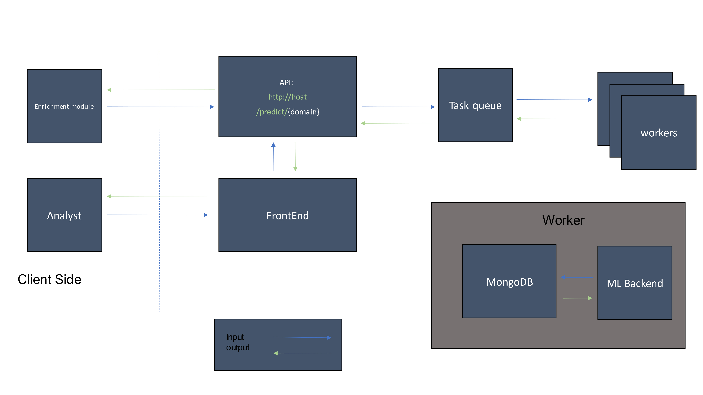

# Looker Plus Plus (lpp)

LPPs goal was to automate analysis of domain related alerts when I was working in a SOC. To do so, I had to join data from an external API and the ticketing system Service Now to make a supervised machine learning model. Inital results were promising but the model's performance did not translate to real world data. Further analysis of the ticket data showed that analysts were rarely in agreement about incident reports with low impact. Since low impact incidents constituted the majority of the positive predictions the project was discontinued.

> **NOTE:**  This project is not intended to run.  It is only used for show-casing the code as an extension of my CV.

## Architecture

The project has an api from which two applications request predictions asynchronously. The EnrichmentModule is a component which listens for domain related alerts, when an alert is found, it requests a prediction from the backend. When this prediction is done, it is sent to another backend along with an url where the analyst can inspect the prediction in the frontend. 

# Technology Used
Following technologies were used in this project

## Frontend
Uses Plotly and  Dash for interactive plots and data visualization.​

​

## EnrichmentModule (em):​

This part uses inhouse python 2.7 code and gevent (worker queue)​ which was extra fun to code because it I coded my own worker queue.

​

## Backend (api): ​

This is where the magic happens. Many technologies are used.

* Celery
* FastAPI
* MongoDB 
* redis 
* RabbitMQ
* SciKitLearn 
* xgboost / shap /etc …​

​

​

​